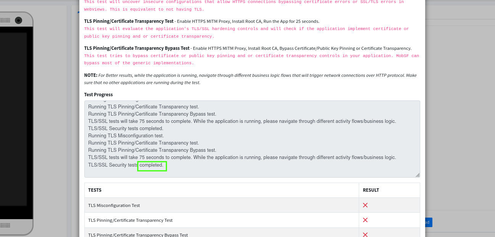
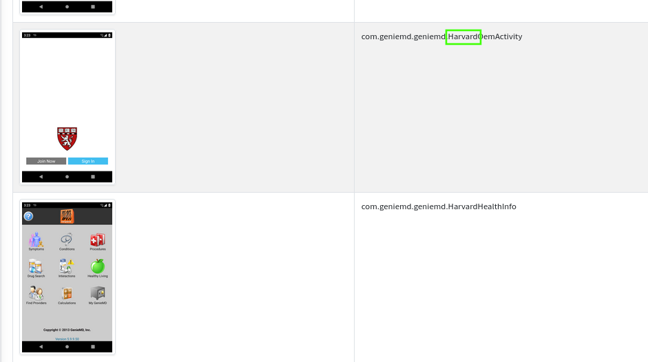
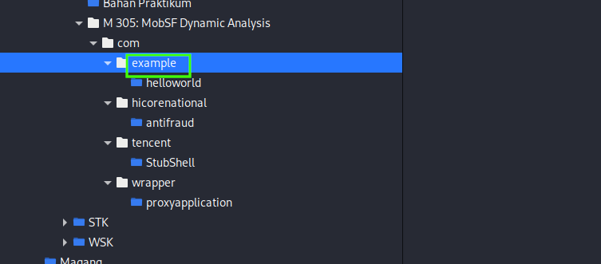
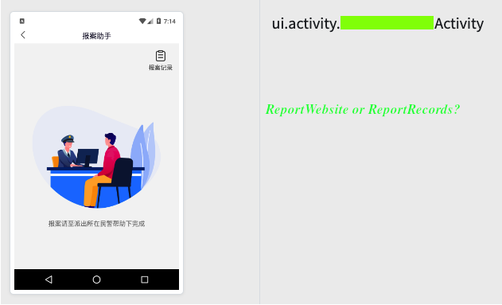
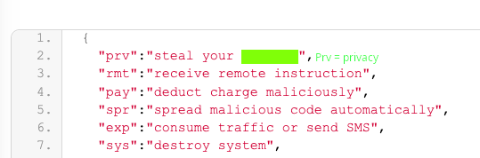

# M305 : MobSF Dynamic Analyzer (Answers)

## Overview
Here's the answer for M305 by Samsclass. I've looked all over the internet but couldn't find it, so I tried the test myself and wrote this write-up for you guys. If you don't want to waste time installing, downloading, problem-solving, and all that—this might be just what you need. Enjoy, mate!

## LINK PROJECT M-305
🔗 **https://samsclass.info/128/proj/M305.htm**

## ANSWERS

#### 1. M 305.1 Test Results (10 pts)

The first task is simple — just wait for the TLS/SSL test to complete. Once it's done, it displays the message *'TLS/SSL security tests __completed__.'* which is the flag.

#### 2. M 305.2 Exported Activity (5 pts)

Although the image is different, the key point is the sentence *OemActivity*, which reveals that the flag is __Harvard__.

#### 3. M 305.3 Helloworld (5 pts)

The directory containing the *helloworld* folder is __example__, which is the flag.

#### 4. M 305.4 Activity Name (10 pts)

i haven't found it yet, i don't know maybe my mobsf or the app itself that's broken. but i think it's between __ReportWebsite__ or __ReportRecords__, because when i translate the page it said *ReportHelper* and i dont see any activity with that name.

Let Me know if you have found it mate.

#### 5. M 305.5 Files (5 pts)

Well, since the activity test is broken, I don't know the answer either. But... I guess it's __privacy__. You can see that *prv* stands for privacy in MobSF, and it matches perfectly with the sentence '*steals your ....*'.

🎯 *Can you find the answer for number 4? Let me know, please.*

© Melkorxr 2025
