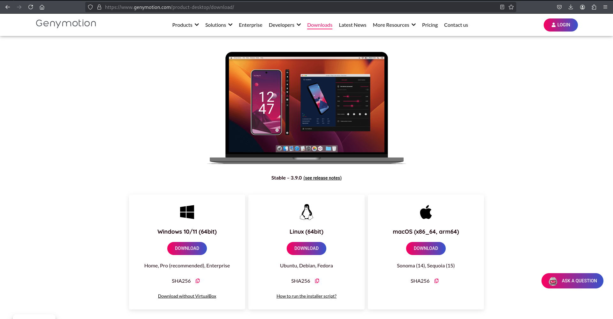
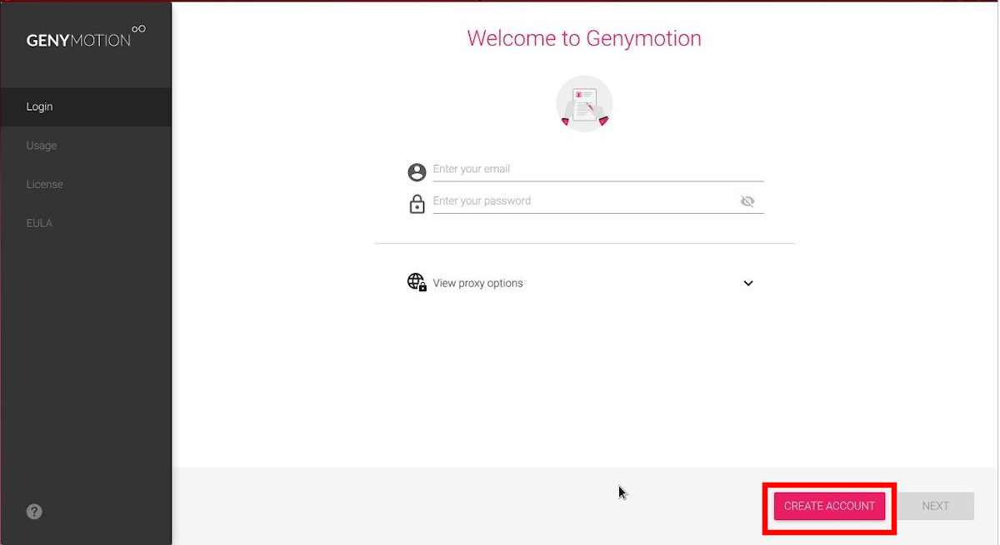
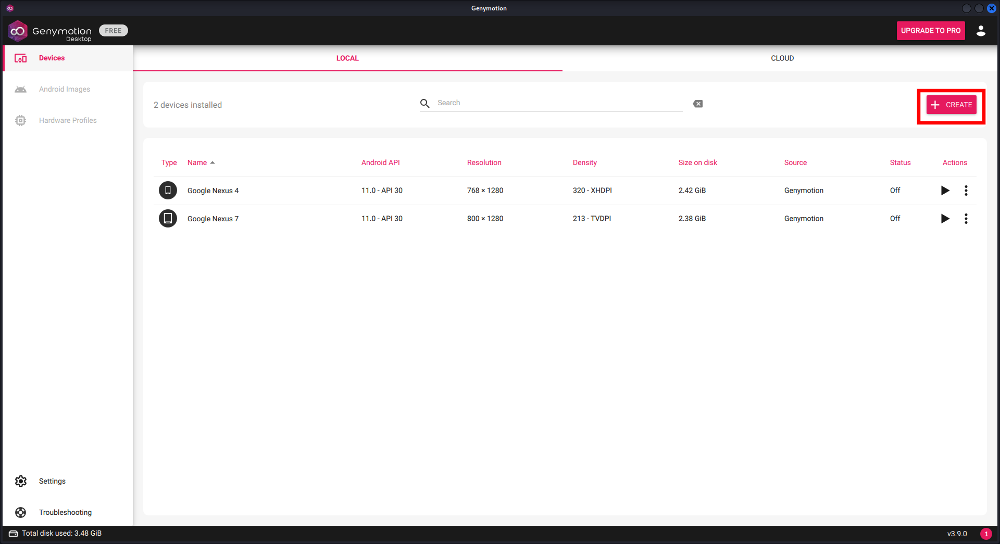
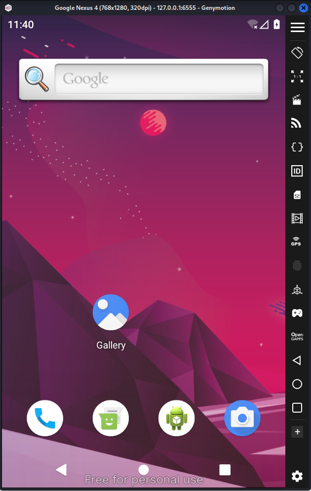
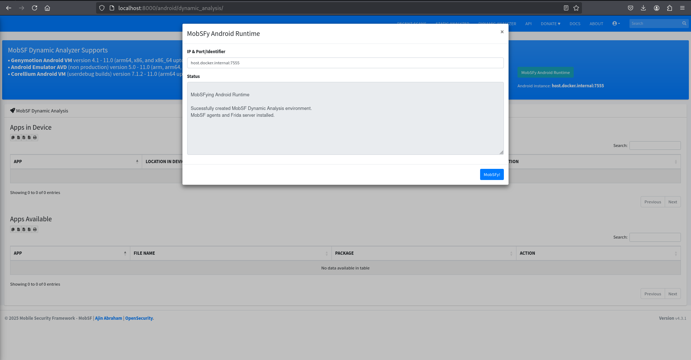
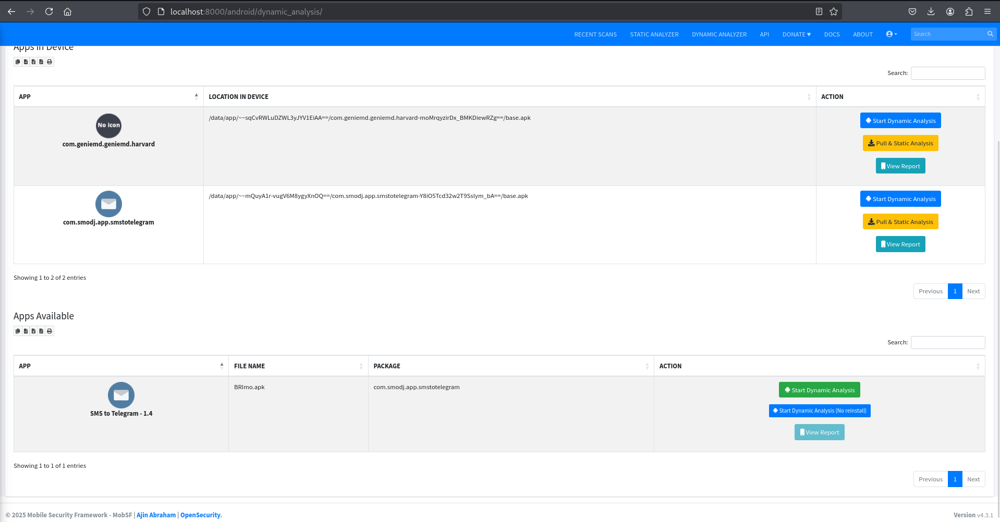
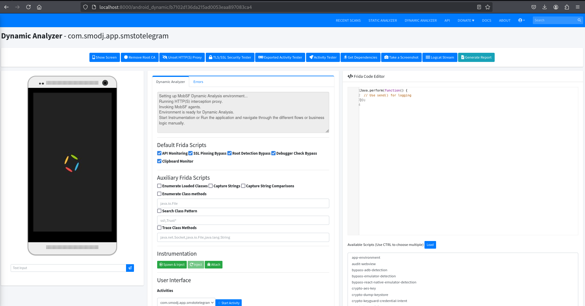

# 🚀 MobSF Dynamic Analyzer for Android on Kali Linux

## Overview

MobSF Dynamic Analyzer is a feature of the Mobile Security Framework that enables runtime analysis of Android applications by executing them on an emulator or a physical device. Unlike static analysis, it observes the app’s behavior in real-time, capturing network traffic, monitoring system logs, tracking file system changes, and detecting suspicious activities such as permission abuse or use of sensitive APIs. It relies on ADB communication and may use tools like Frida for function hooking. This helps security testers uncover runtime vulnerabilities, hidden behaviors, and malicious operations that wouldn't be visible through code analysis alone.

## Tools

1. MobSF 
2. Genymotion
3. Socat

## Steps

#### 1. Download & Login Genymotion Dekstop for Kali Linux
Link download Genymotion Dekstop for Kali Linux:

🔗 **https://www.genymotion.com/product-desktop/download/**

You can read the installation guide on link below:

🔗 **https://docs.genymotion.com/desktop/Get_started/013_Linux_install/** 



After the installation you can run Genymotion on terminal with this command below.
```bash
cd /genymotion/

LIBGL_ALWAYS_SOFTWARE=1 ./genymotion
```
The command is used to launch Genymotion (an Android emulator) while forcing it to use software rendering instead of hardware (GPU) acceleration. This can be useful in environments where GPU drivers are incompatible, missing, or when running inside a virtual machine that doesn't support proper hardware acceleration.

Once you start the Genymotion app, if you don’t have an account, click the "Create Account" button—it will redirect you to the Genymotion sign-up page.

After creating your account, log in using those credentials and select "Personal Use" (which is free).

Note: During the login process, you might face issues such as long loading times or connection timeouts. If this happens, try switching networks—for example, if you're using Wi-Fi, switch to mobile data. Some networks may block Genymotion (I don't know why).

#### 2. Create Device on Genymotion
After successfully logging in to Genymotion, you will be presented with the main dashboard. To create a new virtual device, click on the "Create" button. 

Then, choose a device model (e.g., Google Pixel 4a) and select an Android version that is compatible with MobSF Dynamic Analyzer, such as Android 9 (Pie) or Android 10 (Q). It's recommended to use an image with Google APIs for better compatibility. Once selected, give your device a name and click "Next" to start the downloading and setup process. 

#### 3. Run Socat & MobSF
Socat is used to create a TCP proxy that forwards traffic from a chosen port to port 6555 on localhost (This is crucial because, for some reason, my MobSF Analyzer consistently fails to connect to the ADB device—it always returns a "connection refused" error). The command I use to set up this TCP proxy with socat is as follows:
```bash
socat TCP-LISTEN:7555,fork TCP:127.0.0.1:6555

#For TCP-LISTEN, you can use any available port.
```
Now that Socat has been set up, we can run MobSF using the following command:
```bash
sudo docker run -it --rm --add-host=host.docker.internal:host-gateway -p 8000:8000 \
  -e MOBSF_ANALYZER_IDENTIFIER=host.docker.internal:7555 \
  opensecurity/mobile-security-framework-mobsf:latest
```
This Docker command is used to run the Mobile Security Framework (MobSF) for dynamic analysis. It launches the MobSF container in interactive mode and automatically removes it after use. The command maps the host machine's host.docker.internal to allow the container to communicate with services running outside of Docker, such as an Android emulator. It exposes port 8000 to provide access to the MobSF web interface and sets the MOBSF_ANALYZER_IDENTIFIER environment variable to direct MobSF to the ADB connection of the emulator (in this case, via Socat)

#### 4. Booting Emulator Device
Launch the device and Wait for the Android system to fully boot up—this may take a few minutes depending on your system specs.


Once the virtual device is running, open a terminal and check whether the device is detected by ADB using the following command:
```bash
adb devices

#The expected output is 127.0.0.1:6555. If it's different, update the TCP: address in the socat command accordingly.
```
```bash
#If the output is blank, try reconnecting it manually.

adb connect 127.0.0.1:6555
```
Next, return to MobSF and perform a static analysis. Once the scan is complete, go to the Dynamic Analyzer tab, select Android as the target platform, then click MobSFy Android Runtime. Wait until the process finishes or shows that it is connected.


#### 5. Start Dynamic Analysis
On the Dynamic Analyzer tab, you'll see a list of apps. Choose the one you want to analyze, then click Start Dynamic Analyzer.


Now, you can proceed with dynamic analysis for Android.

```bash
echo "CONGRATULATIONS BRO"
```

🎯 *Let me know if you have a question or some advice for me. Happy testing!*

© Melkorxr 2025
