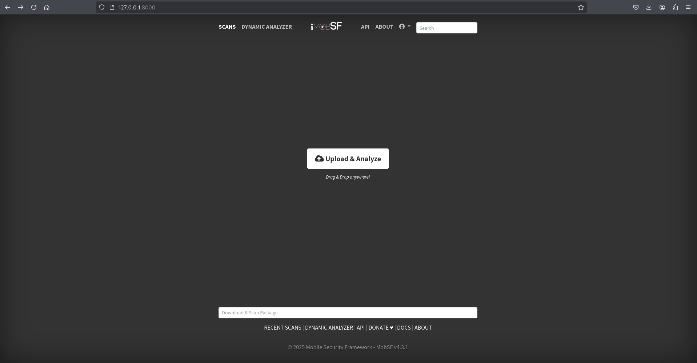

# MSMF
***Mobile Security &amp; Media Forensic***

## Tools
### MobSF
The Mobile Security Framework (MobSF) is an open-source tool designed for automated static and dynamic analysis of mobile applications. It supports Android, iOS, and Windows platforms, providing powerful capabilities for identifying security vulnerabilities, analyzing code structure, and assessing privacy risks. With its user-friendly interface and comprehensive reporting, MobSF is widely used by security researchers and developers to ensure mobile application security.

